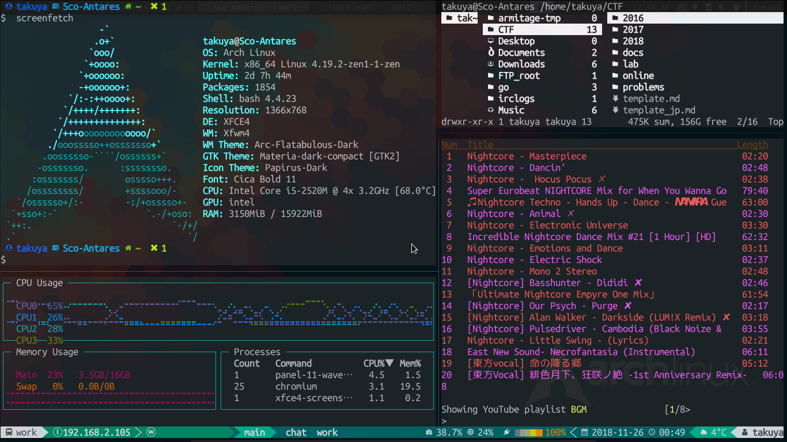
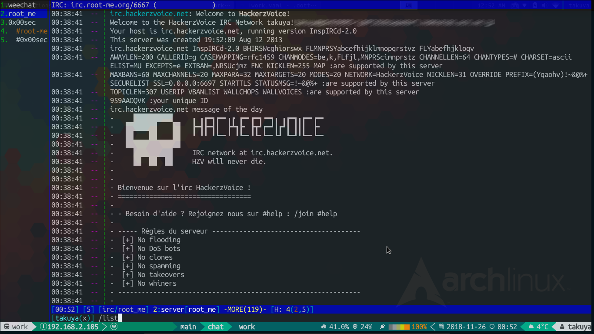

# Dotfiles


[](LICENSE)



Author: takuzoo3868  
Date: 20/Feb/2021 

This is a repository with my configuration files, those are verified on Linux / MacOS.

```
dotfiles/
 ├── bin/            --> Useful command scripts
 ├── config/         --> Dotfiles
 │   ├── bash
 │   ├── fish
 │   ├── git
 │   ├── nvim
 │   ├── nyaovim
 │   ├── radare2
 │   ├── ranger
 │   ├── sqlite
 │   ├── tmux
 │   ├── vim
 │   └── weechat
 ├── doc/            --> Document files (img/md) 
 ├── etc/
 │   ├── init        --> Setup & Install scripts
 │   └── lib         --> Library scripts
 └── Makefile
```

## Setup

Just copy and execute this !!!
```bash
$ bash -c "$(curl -fsSL https://raw.githubusercontent.com/takuzoo3868/dotfiles/master/etc/setup)"
```

If you want to install a [dev-packages](), add `init` as an optional argument.
```bash
$ bash -c "$(curl -fsSL https://raw.githubusercontent.com/takuzoo3868/dotfiles/master/etc/setup)" -s init
```

### Setup using Makefile

```bash
$ git clone https://github.com/takuzoo3868/dotfiles.git $HOME/.dotfiles
$ cd $HOME/.dotfiles
$ make install
```

Incidentally, `make install` will perform the following tasks.
- `make update` Updating dotfiles from this repository
- `make deploy` Deploying dotfiles to host
- `make init` Initializing some settings

Other options can be checked with `make help`.

## Recommend
I recommend installing [Cica](https://github.com/miiton/Cica) or [Nerd fonts](https://github.com/ryanoasis/nerd-fonts) to display graphical icons on terminal. 

A script to automate the installation is placed in `etc/init/install.d/98_font.sh`.

## Screenshot




## References

- [b4b4r07/dotfiles](https://github.com/b4b4r07/dotfiles)

- [dylanaraps/neofetch](https://github.com/dylanaraps/neofetch)